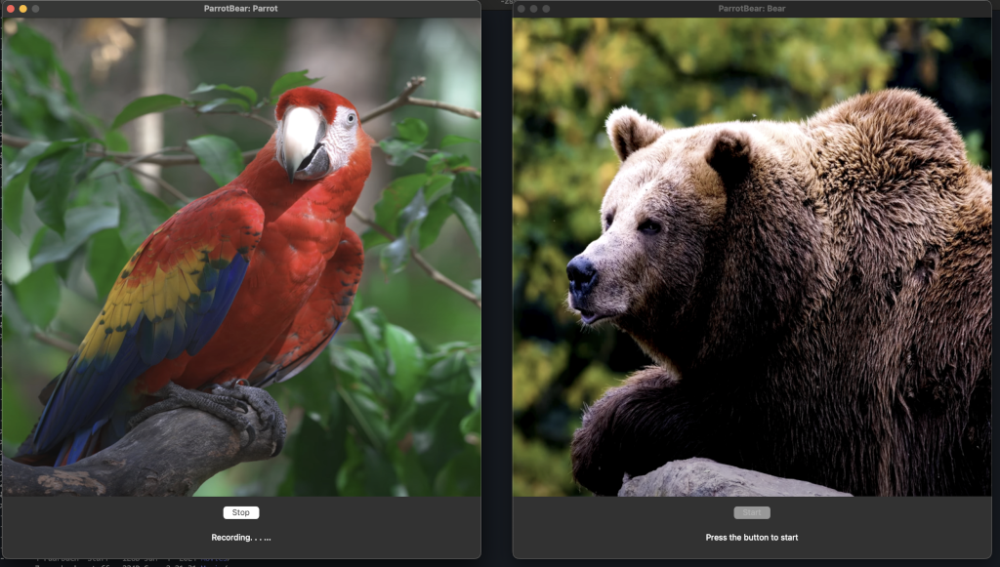

# ParrotBear

This is a simple game for children (age 2-4) where they can speak to either
a parrot or a bear, and the respective animal will answer back the recorded
player in a high/low pitched voice. 

## Install
run `./install.sh` from the cloned repo directory, after granting it permissions
 (`chmod +x install.sh`), and also grant the `run.sh` permissions (`chmod +x run.sh`).

this was only tested on macOS (14.7.2 23H311) with python 3.12, but should be 
easily ported to other operating systems and newer python versions.

## Playing Instructions
to start the game, run `./run.sh` from the cloned repo directory after installing the game.

press the button of the chosen animal to speak with. if you want to switch
 you'll have to click on "Stop" button with the animal you're chatting with, 
 and then click "Start" on the other animal.